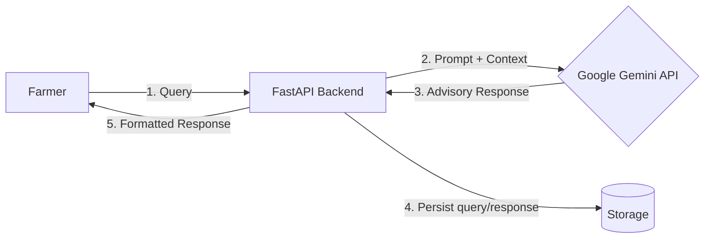

# 🌾 FarmAI — Intelligent Farmer Advisory System

[](https://www.python.org/)
[](https://fastapi.tiangolo.com/)
[](https://www.docker.com/)
[](https://aws.amazon.com/ec2/)
[](LICENSE)

> An async, LLM-powered agricultural advisory backend that gives farmers real-time, context-aware guidance via a conversational API — built on FastAPI, Google Gemini, and containerized AWS infrastructure.

## Overview

FarmAI exposes a lightweight API that lets farmers submit natural-language questions (crop disease, irrigation timing, soil treatment, market advice, etc.) and receive structured, actionable responses generated by Google's Gemini LLM.

- Stateless and horizontally scalable — any backend instance can handle any request
- Cheap to operate — a single EC2 instance can serve meaningfully high concurrency thanks to FastAPI's async I/O
- Auditable — every query/response pair is logged for quality monitoring and future fine-tuning datasets

## Architecture



## Tech Stack

| Layer | Technology | Why |
|---|---|---|
| API Framework | FastAPI (async) | Native async/await, automatic OpenAPI docs, Pydantic validation |
| AI/NLP Engine | Google Gemini API | Strong multilingual and agricultural domain reasoning |
| Server | Uvicorn + Gunicorn workers | Production-grade concurrency management |
| Containerization | Docker | Reproducible builds across dev/staging/prod |
| Cloud Infra | AWS EC2 + Security Groups | Full control over networking, cost-effective |

## Getting Started

```bash
git clone https://github.com/bipinkumar29/farmai-backend.git
cd farmai-backend
python -m venv venv
source venv/bin/activate
pip install -r requirements.txt
cp .env.example .env
uvicorn app.main:app --reload --host 0.0.0.0 --port 8000
```

## API Reference

POST /advisory

```json
{
  "query": "My wheat leaves are turning yellow, what should I do?",
  "crop_type": "wheat",
  "location": "Ludhiana, Punjab"
}
```

## Deployment

```bash
docker build -t farmai-backend .
docker run -d -p 8000:8000 --env-file .env farmai-backend
```

Note: EC2 instance storage is ephemeral. Production deployments should persist logs/queries to a managed store such as RDS or DynamoDB.

## Roadmap

- Add response caching for common queries
- Multilingual prompt templates (Punjabi, Hindi)
- Voice-to-text ingestion
- Feedback loop endpoint to build a fine-tuning dataset
- CI/CD pipeline via GitHub Actions

## License

MIT
